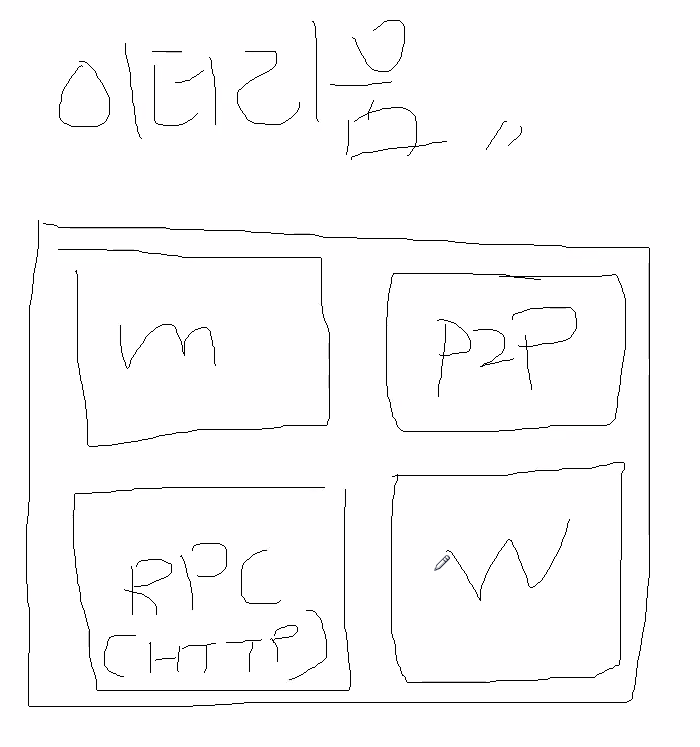
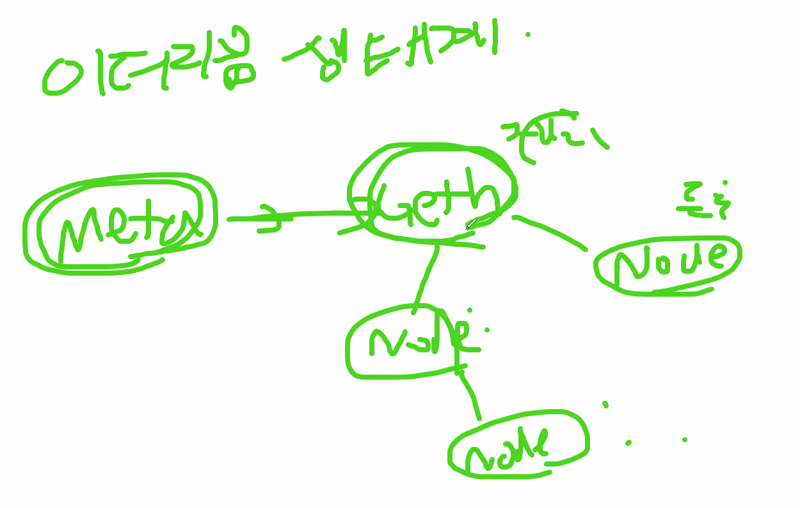
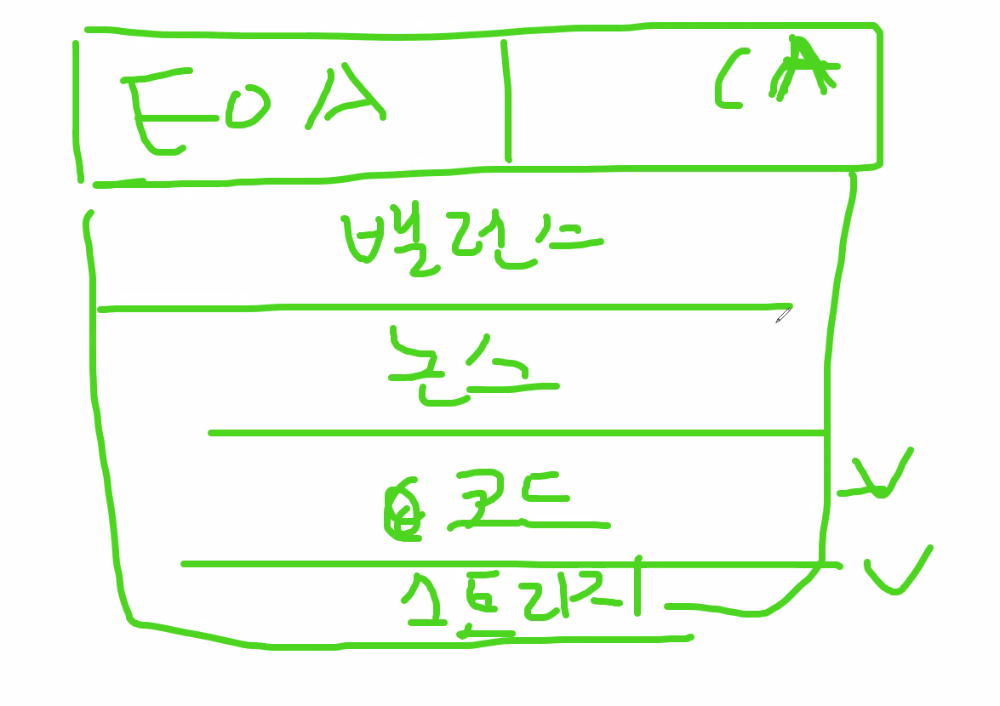
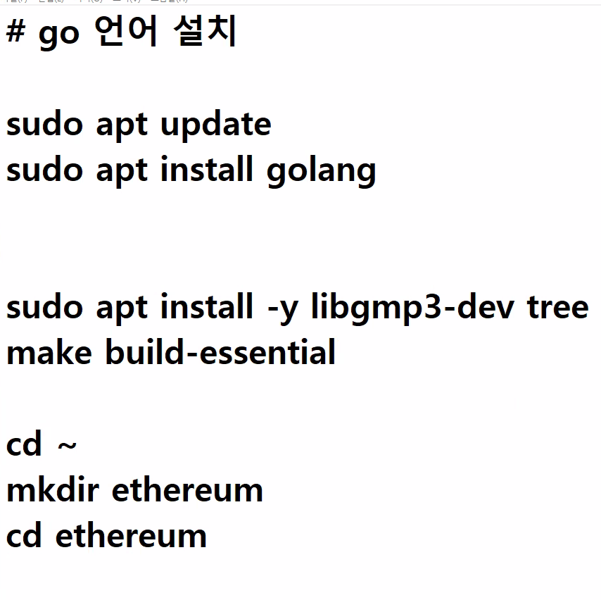
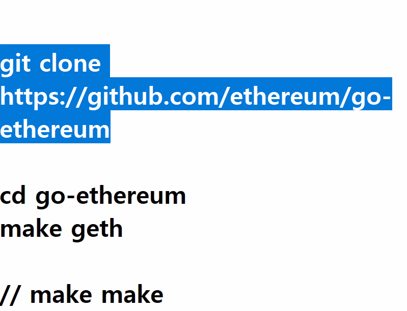

## 이더리움 설치
 
이 기능들이 들어간 클라이언트를 설치한다. (하나의 노드)

GO 언어로 만든 이더리움

G ETH

### 비트코인 vs 이더리움
evm
tx
account
이 세가지에서 차이가 난다.

그 이유는 스마트 컨트랙트 때문이다.

evm ( 이더리움 버츄얼 머신)
(jvm)

web3 -> 이더리움이 만든 라이브러리. (http 통신을 자동으로 하게해주는 놈)

account

EOA CA

EOA : 돈의 입출금의 내용에 대한 계정 (보내는 사람의 주소)

CA : EOA 계정을 가진 tx 의 고유 키값 (배포 할때마다 바뀜)

밸런스 논스 : evm 의 상태.

**이더리움 설치 참조**
git clone https://github.com/ethereum/go-ethereum

https://velog.io/@nara7875/Geth%EC%8B%A4%ED%96%89

노트북 : \\wsl$\Ubuntu\home\kyj\workspace\go-ethereum
